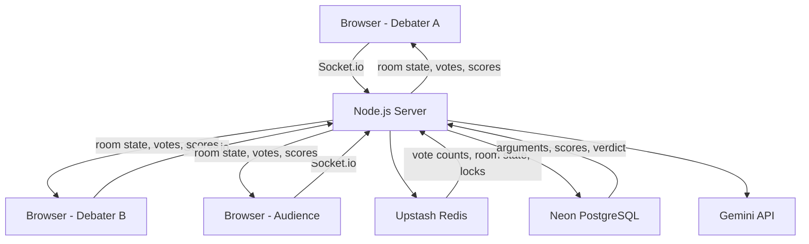
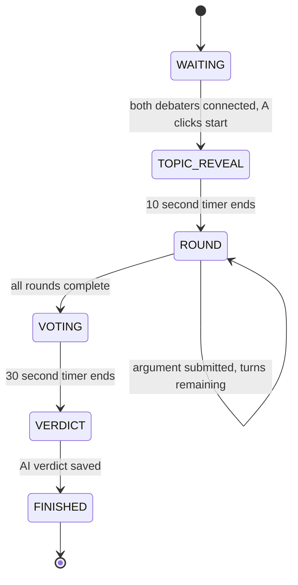
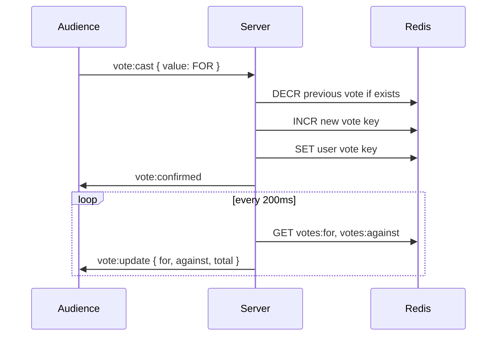
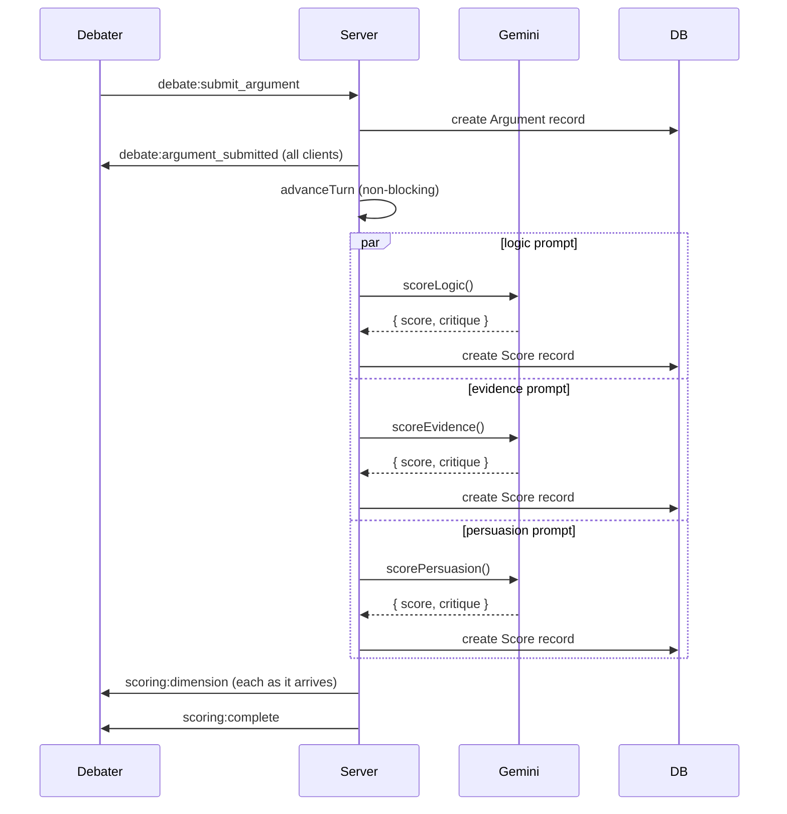
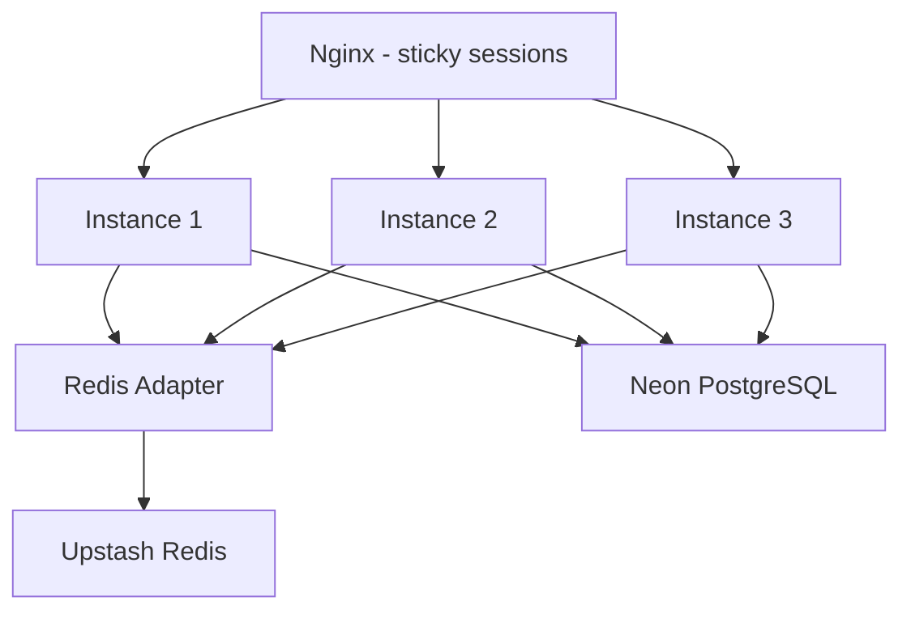
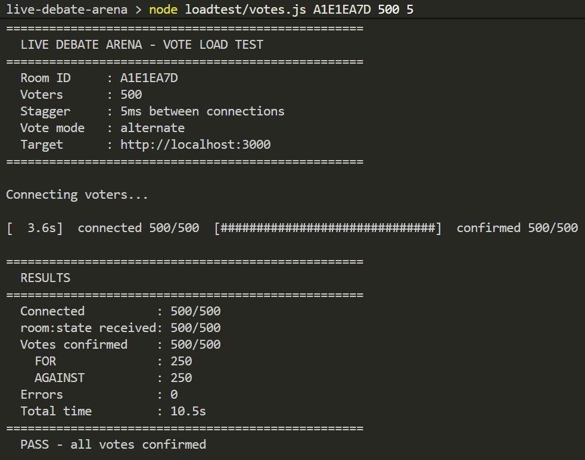
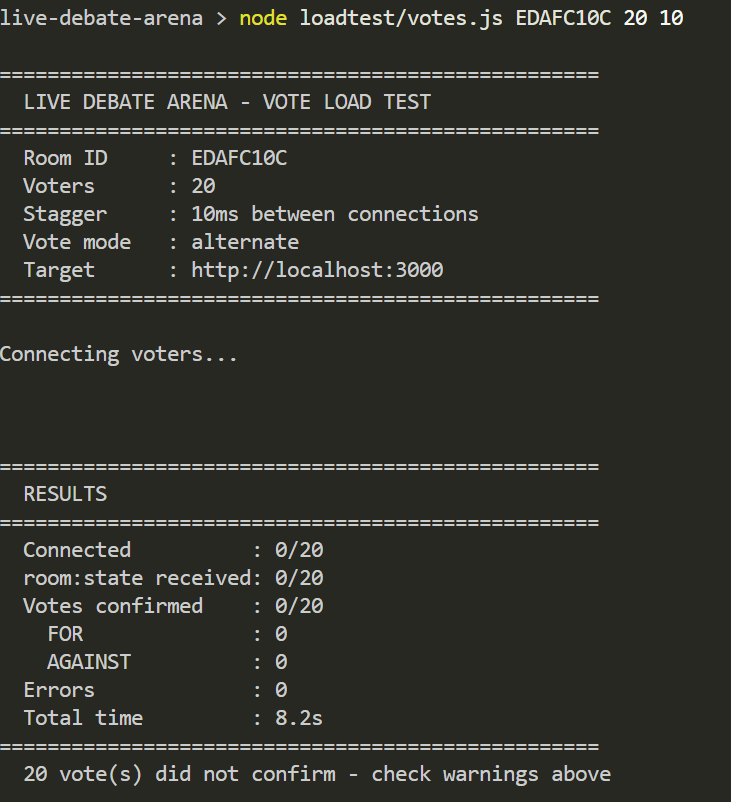

# Debate Platform

A live debate platform where two people argue a topic while an audience votes in real time. AI scores each argument on logic, evidence, and persuasion separately. A full verdict is generated at the end.

Built with Next.js, Socket.io, Redis, PostgreSQL, and Gemini. Designed to scale horizontally across multiple instances using a Redis adapter and distributed locks.


## How it works

Two debaters get private links. An audience joins a public link. The host starts the debate, arguments go back and forth by round, the audience votes live, and when all rounds are done the AI generates a verdict based on the full transcript.


## System overview




## Debate state machine




## Vote aggregation




## AI scoring pipeline




## Horizontal scaling

The server can run as multiple instances behind a load balancer. Socket.io broadcasts are relayed across instances using the Redis adapter, backed by Upstash via ioredis. Timers and the vote pulse use Redis distributed locks so only one instance owns each room's timer and pulse loop at any time, preventing duplicate broadcasts.



This is demonstrated locally with Docker Compose running three containers behind Nginx with `ip_hash` sticky sessions, required because Socket.io connections must stay on the same instance for their duration. Production deployment runs as a single instance on Render free tier, which is a cost decision rather than an architectural limitation. The same image works with multiple instances on any provider that supports horizontal scaling.


## Reconnection handling

If a debater disconnects mid-debate, a 30 second grace period begins before their slot is marked disconnected. If they reconnect within that window, the room is notified and nothing is lost. Anyone who joins or rejoins receives the full argument history and current AI scores from PostgreSQL so their view is always in sync regardless of which events they missed.

## Caching and database strategy

Redis is now the primary source for room existence and live state. On socket connection the middleware checks Redis first. A cache hit means zero Postgres queries for room existence. A miss falls back to Prisma once, then populates Redis so every subsequent connection is a hit.

Debate history (arguments plus AI scores) is cached in Redis under room:{roomId}:history. On join, Redis is checked first. A hit returns the full argument list with no Postgres call. A miss runs the Prisma query once and writes the result for everyone after.

The cache stays in sync incrementally as the debate progresses. appendCachedArgument runs right after each new Argument row is saved. updateCachedArgumentScores patches that argument entry as each AI score arrives. No full re-fetches needed.

Net result for 100-500 concurrent audience joins: before this change, each join ran 2 Prisma queries. After, the common case is 0.


## Vote rate limiting

The audience link is public by design. Without limits, anyone with the link could script many connections with different session IDs and swing the opinion meter. Three Redis-backed limits are applied:

  Per IP, 20 socket connections per 60 seconds
    Caps how many fake audience members one IP can open.

  Per IP, 30 vote:cast events per 60 seconds
    Caps total votes from one IP regardless of session count.

  Per session, 1 vote change per 2 seconds
    Stops spam clicking and rapid vote toggling.

All use a Redis INCR fixed-window counter. Generous for real users,
meaningful friction for scripts.


## Load testing

Run vote load tests with:
```bash
node loadtest/votes.js ROOM_ID numVoters staggerMs voteValue
```
The debate must be in ROUND or VOTING state before running. The script
prints a live progress bar as connections open and votes confirm, and a
summary table at the end.

200 voters, 0ms stagger between each connection
```bash  
node loadtest/votes.js [ROOM_ID] 200 0
```

Keep the audience tab open while running. The opinion meter updates
within roughly 400ms of the script finishing.




## RateLimit Testing



## Getting started

Clone the repo and install dependencies.

```bash
npm install
```

Create a env file and fill in your values.
You need accounts on Neon, Upstash or local instance, and Google AI Studio. All are free.

Push the database schema.

```bash
npx prisma generate
npx prisma db push
```

Start the dev server.

```bash
npm run dev
```

Open http://localhost:3000, create a room, and share the links.


## Environment variables

```
NEXT_PUBLIC_APP_URL      URL of the app, http://localhost:3000 in dev
DATABASE_URL             Neon PostgreSQL connection string
REDIS_URL                Upstash ioredis connection string, used by the Socket.io adapter
GEMINI_API_KEY           Google AI Studio API key
DEBATER_JWT_SECRET       Any random 32 character string
```


## Running tests

```bash
npm run test
```

Covers the debate state machine transitions, vote aggregation logic, and Redis distributed locks. All Redis calls are mocked so tests run without a live database.


## Running multiple instances locally with Docker

```bash
docker compose up --build
```

This builds the image once and starts three containers plus an Nginx load balancer on port 3000. All three containers connect to the same remote Neon and Upstash instances. Use this to verify the Redis adapter and distributed locks work correctly across instances before deploying.

```bash
docker compose down
```


## Deployment

The app runs as a single Node.js service on Render free tier. Socket.io and Next.js share the same HTTP server so no separate WebSocket service is needed.

Build command:

```bash
npm install && npx prisma generate && npm run build
```

Start command:

```bash
npm run start
```

Set all environment variables including REDIS_URL in the Render dashboard. Make sure NEXT_PUBLIC_APP_URL matches your Render service URL exactly.

A GitHub Actions workflow runs tests on every push and pull request to main. On successful pushes to main it triggers a Render deploy via a deploy hook stored as a repository secret.


## Tech stack

Next.js with App Router handles pages and API routes. A custom server.ts attaches Socket.io to the same HTTP instance so everything runs on one port.

Upstash Redis stores live room state and vote counters using atomic INCR and DECR operations to handle concurrent votes safely, and backs the Socket.io adapter for cross-instance broadcasting via ioredis.

Neon PostgreSQL stores the permanent record of every debate including arguments, scores, and the final verdict. Prisma handles all queries.

Gemini 2.0 Flash scores each argument with three separate focused prompts and generates the final verdict from the full transcript.

Jest covers the state machine, vote logic, and distributed locks. Docker and Docker Compose with Nginx demonstrate horizontal scaling locally. GitHub Actions runs CI and triggers deployment.


## Known limitation - vote integrity

Per-IP rate limiting raises the bar for vote manipulation but does not fully prevent it. Proxy pool or VPN rotation can still distribute connections across many IPs, each one under the per-IP limit. This is the same limitation all public no-login polling systems face.

Possible future mitigations:
  Lightweight CAPTCHA on the audience join page
  Server-set httpOnly cookie binding instead of client-generated sessionId
  Optional verified audience mode requiring a visible display name
  Flagging sessions that connect and vote within an unusually short window

This is a deliberate scope boundary for the current version.

## Author
Anchal Jain 2026