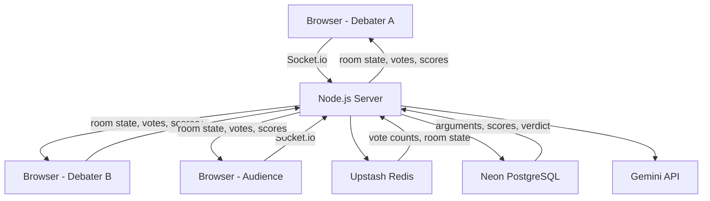
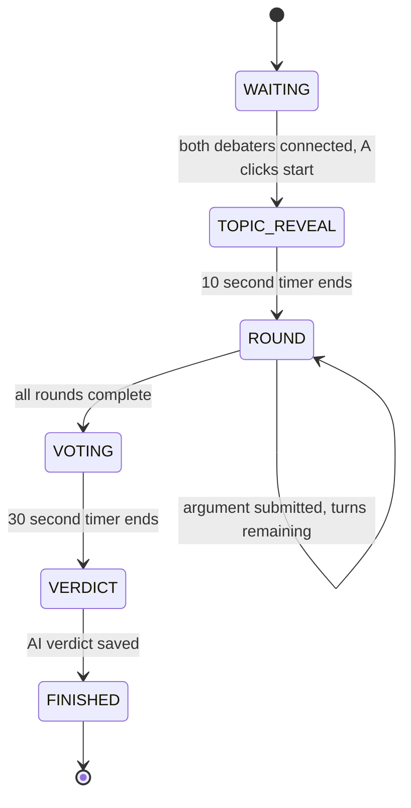
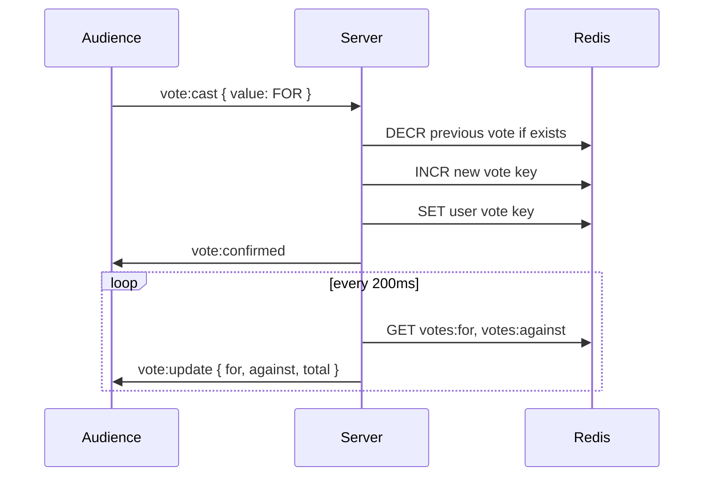
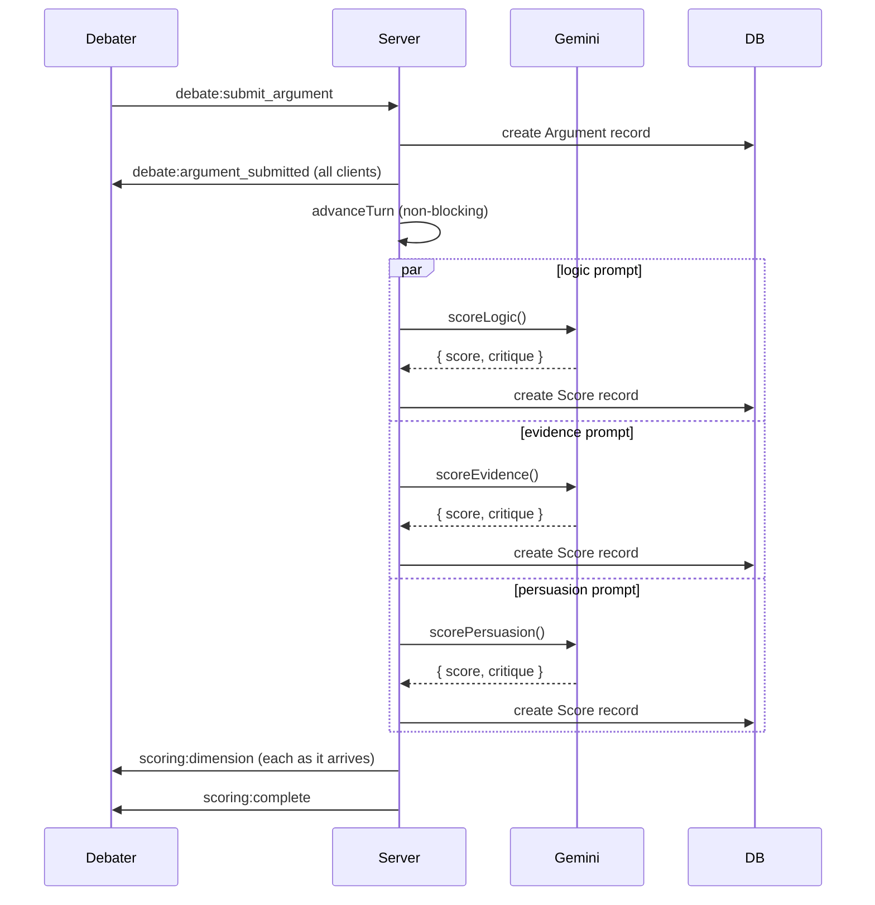

# Debate Platform

A live debate platform where two people argue a topic while an audience votes in real time. AI scores each argument on logic, evidence, and persuasion separately. A full verdict is generated at the end.

Built with Next.js, Socket.io, Redis, PostgreSQL, and Gemini.


## How it works

Two debaters get private links. An audience joins a public link. The host starts the debate, arguments go back and forth by round, the audience votes live, and when all rounds are done the AI generates a verdict based on the full transcript.


## System overview




## Debate state machine




## Vote aggregation




## AI scoring pipeline




## Getting started

Clone the repo and install dependencies.

```bash
npm install
```

Copy the example env file and fill in your values.

```bash
cp .env.local.example .env.local
```

You need accounts on Neon, Upstash, and Google AI Studio. All are free.

Push the database schema.

```bash
npx prisma generate
npx prisma db push
```

Start the dev server.

```bash
npm run dev
```

Open http://localhost:3000, create a room, and share the links.


## Environment variables

```
NEXT_PUBLIC_APP_URL      URL of the app, http://localhost:3000 in dev
DATABASE_URL             Neon PostgreSQL connection string
UPSTASH_REDIS_REST_URL   Upstash Redis REST URL
UPSTASH_REDIS_REST_TOKEN Upstash Redis REST token
GEMINI_API_KEY           Google AI Studio API key
DEBATER_JWT_SECRET       Any random 32 character string
```

## Tech stack

Next.js with App Router handles pages and API routes. A custom server.ts attaches Socket.io to the same HTTP instance so everything runs on one port.

Upstash Redis stores live room state and vote counters using atomic INCR and DECR operations to handle concurrent votes safely.

Neon PostgreSQL stores the permanent record of every debate including arguments, scores, and the final verdict. Prisma handles all queries.

Gemini 2.0 Flash scores each argument with three separate focused prompts and generates the final verdict from the full transcript.